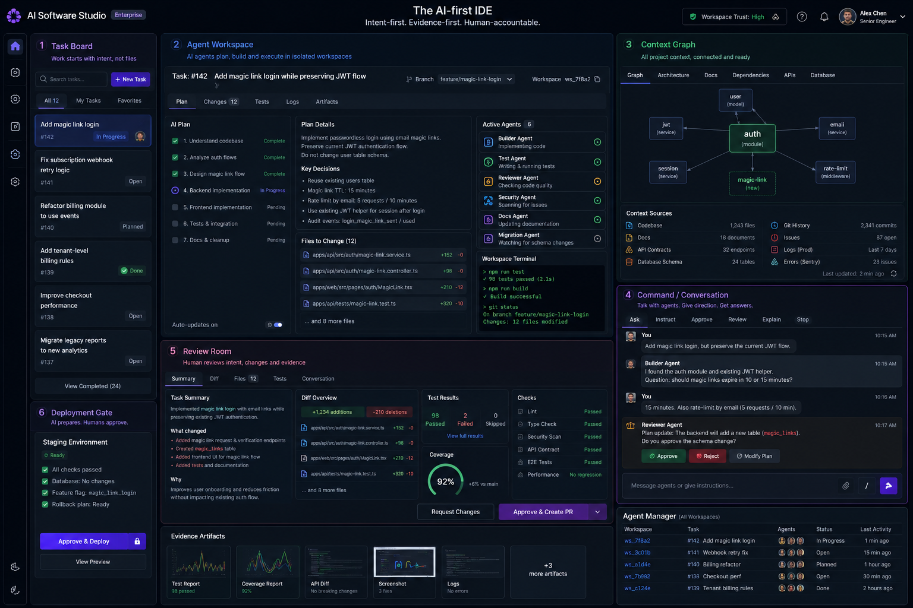

<div align="center">

# AI Software Studio

**A local-first command center for AI coding agents.**
Delegate tasks to Claude Code and Codex CLI. Watch them work in isolated git worktrees. Review verified evidence — not vibes — before you approve.

[](./LICENSE)
[](./CHANGELOG.md)
[](./VERSION)
[](#prerequisites)
[](#stack)



</div>

---

## Why

Coding with a local AI agent today looks like this:

> You ask an AI to edit your code. It edits files in your working tree. You read what it tells you. You hope it's true.

That's not a software development workflow — that's faith.

**AI Software Studio** is the workflow layer that's been missing:

```text
Task  →  Constraints  →  Isolated git worktree  →  Agent execution
      →  Captured terminal & diff  →  Independent verification
      →  Review room with evidence  →  Human approval  →  PR report
```

The agent does the work. The app captures the proof. **You decide what ships.**

## Principles

- 🏠 **Local-first.** The core product runs on your machine. No hosted backend required.
- 🔑 **No provider tokens stored.** Claude Code and Codex CLI handle their own auth. The app never sees your API keys.
- 🧪 **Evidence over claims.** "Tests pass" doesn't count until the app reruns them itself.
- 🌳 **Isolated by default.** Every task gets a fresh git worktree. Your main branch is sacred.
- 🤝 **Human-approved.** Agents execute; humans own intent, review, and the merge button.
- 🔌 **Engine-agnostic.** Claude Code and Codex CLI to start. The adapter layer is built for more.

## How it works

| Step | What you do | What the app does |
|---|---|---|
| **1. Frame** | Write a task, acceptance criteria, constraints | Persists structured task in SQLite |
| **2. Isolate** | Pick an engine | `git worktree add` on a fresh branch |
| **3. Run** | Hit Start | Spawns Claude Code / Codex inside the worktree, streams output |
| **4. Verify** | (Automatic) | Runs your project's test / lint / typecheck / build commands |
| **5. Review** | Read the evidence | Shows diff, changed files, verification results, risk flags |
| **6. Decide** | Approve / request changes / reject | Generates a PR-ready evidence report |

## Status

This is **0.0.1 — pre-MVP scaffold**. The architecture, types, UI shell, and Tauri bridge are in place. Real engine execution, worktree management, and verification runs are next on the roadmap. See [`CHANGELOG.md`](./CHANGELOG.md) for what's actually shipped.

## Stack

| Layer | Choice | Why |
|---|---|---|
| Desktop shell | **Tauri 2** | Native window, small binary, Rust core |
| Native runtime | **Rust** | Owns process spawning, git, filesystem, SQLite |
| Frontend | **Next.js 15 + React 19 (static export)** | Familiar UI stack, no SSR runtime needed |
| Styling | **Tailwind v4 + shadcn/ui** | Composable primitives, dark by default |
| State | **Zustand + TanStack Query** | Local UI state vs. server state, cleanly split |
| Bridge | **tauri-specta** | One source of truth: Rust types → typed TS client |
| Storage | **SQLite + filesystem** | Structured metadata + large artifacts side-by-side |

Read [`docs/architecture/architecture.md`](./docs/architecture/architecture.md) and the [ADRs](./docs/architecture/adr/) for the full picture.

## Quick start

### Prerequisites

- **Node.js ≥ 20**
- **pnpm ≥ 9** (`npm install -g pnpm`)
- **Rust ≥ 1.78** ([install via `rustup`](https://rustup.rs/))
- **Xcode Command Line Tools** (macOS) or **`build-essential`** (Linux)

> Windows is intentionally out of scope for now — see [ADR 0003](./docs/architecture/adr/0003-support-macos-and-linux-only-initially.md).

### Run it

```bash
git clone git@github.com:ronimoe/ai-software-studio.git
cd ai-software-studio
pnpm install

pnpm dev          # browser-only, fast iteration with mock dispatcher
pnpm tauri:dev    # full desktop window with the Rust backend
```

### Common scripts

| Command | What it does |
|---|---|
| `pnpm dev` | Next.js dev server — UI only, mocked Tauri commands |
| `pnpm tauri:dev` | Full desktop app with Rust backend |
| `pnpm test` | Unit tests (Vitest) |
| `pnpm typecheck` | TypeScript strict check |
| `pnpm lint` | ESLint |
| `pnpm build` | Static export to `out/` |
| `pnpm tauri:build` | Desktop bundle (`.app` / `.AppImage` / `.deb`) |
| `pnpm gen:bindings` | Regenerate `lib/bindings.ts` from Rust types |

> `lib/bindings.ts` is generated from Rust via `tauri-specta` and `.gitignore`d. `predev`, `pretypecheck`, and `pretauri:dev` regenerate it automatically. If your IDE complains it doesn't exist, run `pnpm gen:bindings`.

## Documentation

The [`docs/`](./docs/) folder is the canonical reference.

- **[Product Brief](./docs/product-brief.md)** — vision, users, positioning
- **[Product Spec](./docs/product-spec.md)** — flows, modules, MVP scope
- **[Architecture](./docs/architecture/architecture.md)** — system design
- **[ADRs](./docs/architecture/adr/)** — load-bearing decisions, with rationale
- **[Diagrams](./docs/architecture/diagrams/)** — context, container, runtime, lifecycle
- **[Exploration notes](./docs/exploration/)** — research spikes (PTY, engine adapters, packaging, GitHub, artifacts, MCP)

## Contributing

Issues and pull requests are welcome. Before opening a large PR, please skim:

1. [`docs/architecture/architecture.md`](./docs/architecture/architecture.md) — the two-process split is load-bearing
2. The relevant [ADR](./docs/architecture/adr/) — many "obvious" changes have a written-down reason they weren't taken

For new features, run `pnpm typecheck && pnpm lint && pnpm test` before pushing.

## License

[MIT](./LICENSE) © Roni Moe

---

<div align="center">
<sub>Built on the bet that the missing piece of AI-assisted development isn't a smarter model — it's a workflow that lets you trust the output.</sub>
</div>
