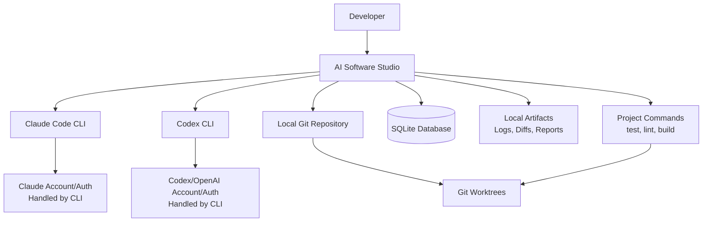

# Diagram: System Context

```mermaid
flowchart TD
    Developer[Developer] --> App[AI Software Studio]

    App --> Claude[Claude Code CLI]
    App --> Codex[Codex CLI]
    App --> Git[Local Git Repository]
    App --> DB[(SQLite Database)]
    App --> Artifacts[Local Artifacts<br/>Logs, Diffs, Reports]
    App --> Commands[Project Commands<br/>test, lint, build]

    Claude --> ProviderA[Claude Account/Auth<br/>Handled by CLI]
    Codex --> ProviderB[Codex/OpenAI Account/Auth<br/>Handled by CLI]

    Git --> Worktrees[Git Worktrees]
    Commands --> Worktrees
```
