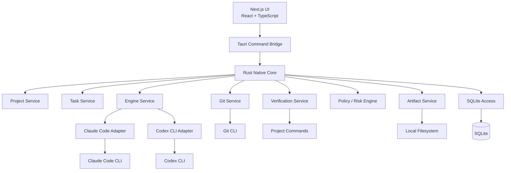

# Diagram: Container Architecture

```mermaid
flowchart TD
    UI[Next.js UI<br/>React + TypeScript] --> Bridge[Tauri Command Bridge]

    Bridge --> Core[Rust Native Core]

    Core --> Project[Project Service]
    Core --> Task[Task Service]
    Core --> Engine[Engine Service]
    Core --> Git[Git Service]
    Core --> Verify[Verification Service]
    Core --> Policy[Policy / Risk Engine]
    Core --> Artifact[Artifact Service]
    Core --> Database[SQLite Access]

    Engine --> Claude[Claude Code Adapter]
    Engine --> Codex[Codex CLI Adapter]

    Claude --> ClaudeCLI[Claude Code CLI]
    Codex --> CodexCLI[Codex CLI]

    Git --> GitCLI[Git CLI]
    Verify --> ProjectCommands[Project Commands]
    Artifact --> Filesystem[Local Filesystem]
    Database --> SQLite[(SQLite)]
```
