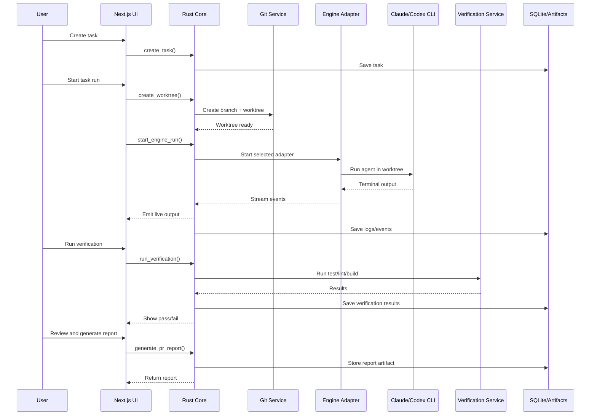

# Diagram: Runtime Flow

```mermaid
sequenceDiagram
    participant User
    participant UI as Next.js UI
    participant Core as Rust Core
    participant Git as Git Service
    participant Engine as Engine Adapter
    participant CLI as Claude/Codex CLI
    participant Verify as Verification Service
    participant DB as SQLite/Artifacts

    User->>UI: Create task
    UI->>Core: create_task()
    Core->>DB: Save task

    User->>UI: Start task run
    UI->>Core: create_worktree()
    Core->>Git: Create branch + worktree
    Git-->>Core: Worktree ready

    UI->>Core: start_engine_run()
    Core->>Engine: Start selected adapter
    Engine->>CLI: Run agent in worktree

    CLI-->>Engine: Terminal output
    Engine-->>Core: Stream events
    Core-->>UI: Emit live output
    Core->>DB: Save logs/events

    User->>UI: Run verification
    UI->>Core: run_verification()
    Core->>Verify: Run test/lint/build
    Verify-->>Core: Results
    Core->>DB: Save verification results
    Core-->>UI: Show pass/fail

    User->>UI: Review and generate report
    UI->>Core: generate_pr_report()
    Core->>DB: Store report artifact
    Core-->>UI: Return report
```
