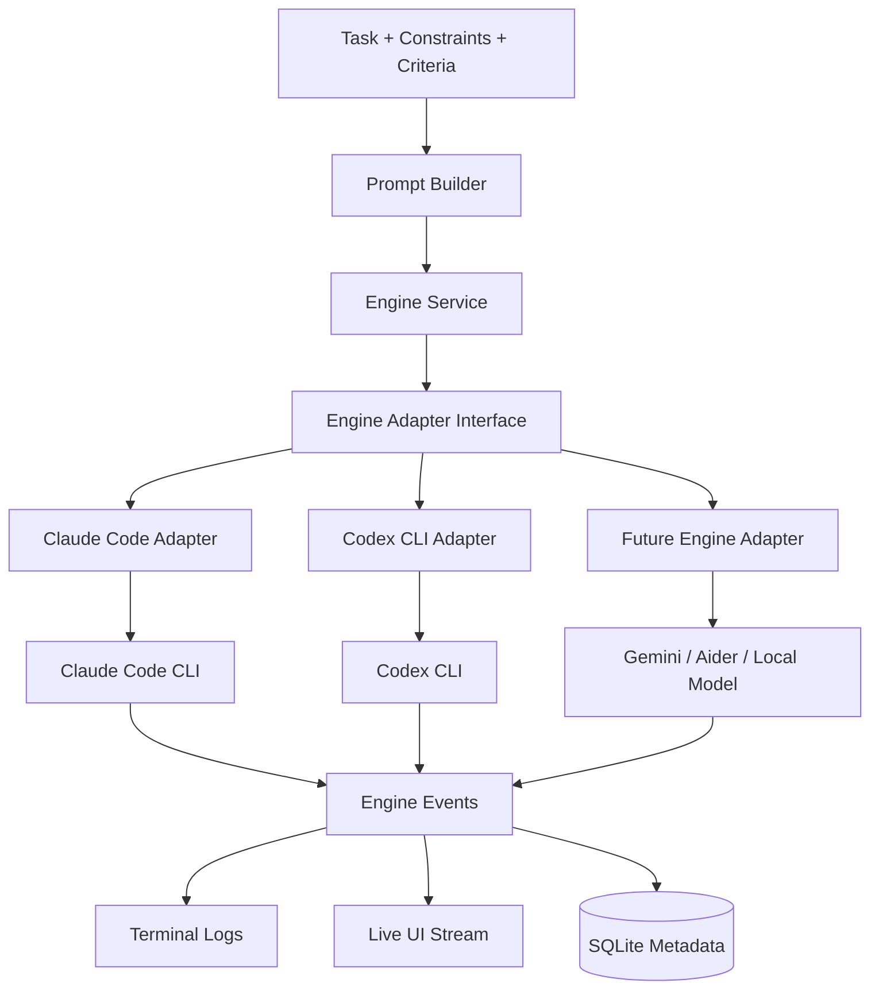

# Diagram: Engine Adapter Flow

```mermaid
flowchart TD
    Task[Task + Constraints + Criteria] --> Prompt[Prompt Builder]
    Prompt --> EngineService[Engine Service]

    EngineService --> AdapterInterface[Engine Adapter Interface]

    AdapterInterface --> ClaudeAdapter[Claude Code Adapter]
    AdapterInterface --> CodexAdapter[Codex CLI Adapter]
    AdapterInterface --> FutureAdapter[Future Engine Adapter]

    ClaudeAdapter --> ClaudeCLI[Claude Code CLI]
    CodexAdapter --> CodexCLI[Codex CLI]
    FutureAdapter --> FutureEngine[Gemini / Aider / Local Model]

    ClaudeCLI --> Events[Engine Events]
    CodexCLI --> Events
    FutureEngine --> Events

    Events --> Logs[Terminal Logs]
    Events --> UI[Live UI Stream]
    Events --> DB[(SQLite Metadata)]
```
