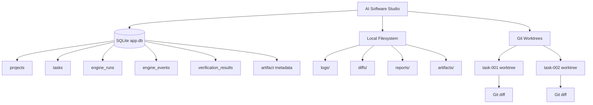

# Diagram: Data Storage

```mermaid
flowchart TD
    App[AI Software Studio] --> SQLite[(SQLite app.db)]
    App --> Files[Local Filesystem]
    App --> Worktrees[Git Worktrees]

    SQLite --> Projects[projects]
    SQLite --> Tasks[tasks]
    SQLite --> Runs[engine_runs]
    SQLite --> Events[engine_events]
    SQLite --> Results[verification_results]
    SQLite --> Metadata[artifact metadata]

    Files --> Logs[logs/]
    Files --> Diffs[diffs/]
    Files --> Reports[reports/]
    Files --> Artifacts[artifacts/]

    Worktrees --> TaskWorktree1[task-001 worktree]
    Worktrees --> TaskWorktree2[task-002 worktree]

    TaskWorktree1 --> GitDiff1[Git diff]
    TaskWorktree2 --> GitDiff2[Git diff]
```
