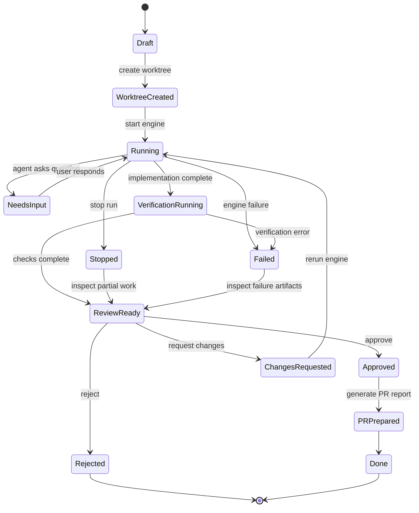

# Diagram: Task Lifecycle

```mermaid
stateDiagram-v2
    [*] --> Draft
    Draft --> WorktreeCreated: create worktree
    WorktreeCreated --> Running: start engine
    Running --> NeedsInput: agent asks question
    NeedsInput --> Running: user responds
    Running --> VerificationRunning: implementation complete
    VerificationRunning --> ReviewReady: checks complete

    ReviewReady --> Approved: approve
    ReviewReady --> ChangesRequested: request changes
    ReviewReady --> Rejected: reject

    ChangesRequested --> Running: rerun engine
    Approved --> PRPrepared: generate PR report
    PRPrepared --> Done

    Running --> Stopped: stop run
    Running --> Failed: engine failure
    VerificationRunning --> Failed: verification error

    Stopped --> ReviewReady: inspect partial work
    Failed --> ReviewReady: inspect failure artifacts
    Rejected --> [*]
    Done --> [*]
```
